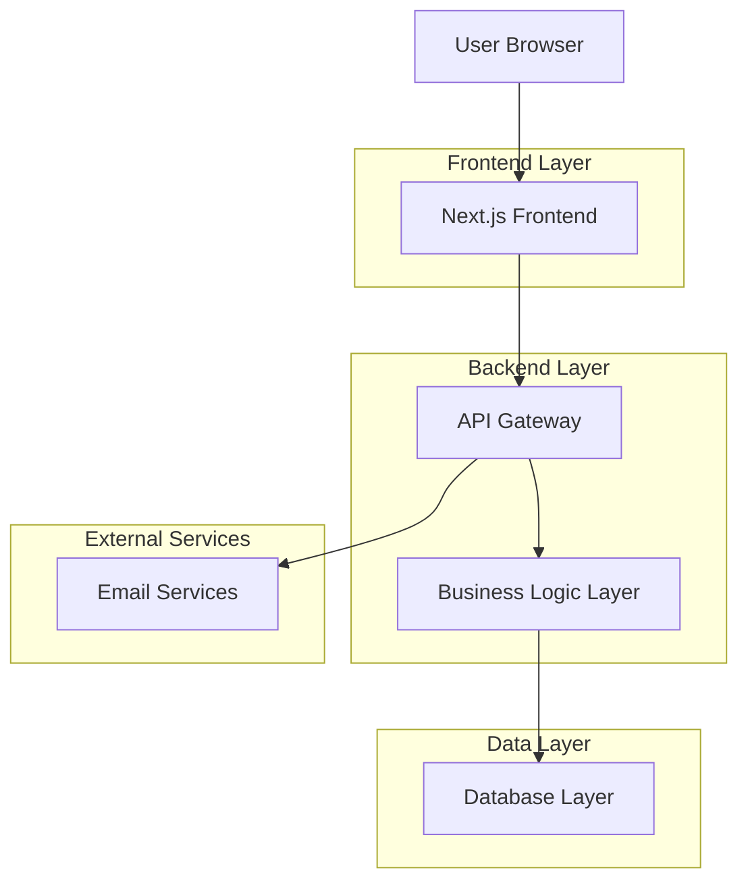
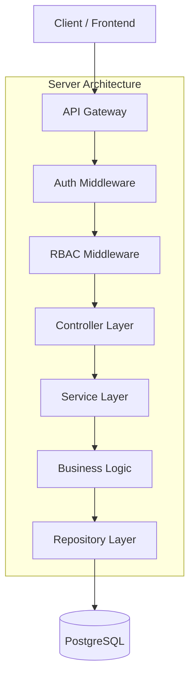
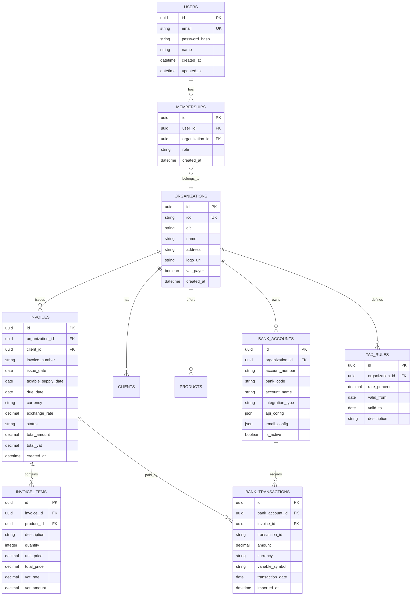

# Vulpi - Technická Architektura (Fáze 1)

## 1. Architecture design



## 2. Technology Description

- Frontend: Next.js@15 (React@19) + TailwindCSS@4 + Shadcn/UI
- Backend: Node.js + NestJS
- Database: PostgreSQL + Prisma ORM
- Business Logic: Pure TypeScript packages
- PDF Generation: Puppeteer + QR Code libraries
- Monorepo: Turborepo
- Initialization Tool: create-turbo

## 3. Route definitions

| Route | Purpose |
|-------|---------|
| / | Landing page |
| /auth/login | Přihlášení uživatele |
| /auth/register | Registrace uživatele |
| /dashboard | Hlavní dashboard |
| /organizations | Správa organizací |
| /invoices | Seznam faktur |
| /invoices/new | Vytvoření nové faktury |
| /invoices/[id] | Detail faktury |
| /clients | Správa klientů |
| /products | Správa produktů |
| /settings | Nastavení organizace |
| /bank-accounts | Správa bankovních účtů |
| /pos | Pokladní systém (Cash Desk) |
| /edi | Elektronická výměna dat |
| /hr | Lidské zdroje a Cestovní příkazy |
| /admin | Administrace systému (SuperAdmin) |

## 4. Implemented Modules (Phases)

Based on the codebase structure, the following 33 modules/phases are implemented:

1. Analytics
2. Api-keys
3. Assets
4. Audit
5. Auth (Identity & Security)
6. Backup
7. Cash-desk
8. Communication
9. Contracts
10. Crm
11. Database
12. Edi
13. Expenses
14. External-api
15. Hr
16. Intelligence (AI)
17. Inventory
18. Invoices
19. Marketing
20. Organizations
21. Pos
22. Pricing
23. Projects
24. Sales
25. Security
26. System-health
27. Time-tracking
28. Travel
29. Users
30. Webhooks
31. Business Logic (Shared)
32. UI Components (Shared)
33. Utilities (Shared)

## 5. API definitions

### 4.1 Authentication API

```
POST /api/auth/login
```

Request:
| Param Name | Param Type | isRequired | Description |
|------------|------------|------------|-------------|
| email | string | true | Email uživatele |
| password | string | true | Heslo uživatele |

Response:
| Param Name | Param Type | Description |
|------------|------------|-------------|
| token | string | JWT token |
| user | object | Uživatelské údaje |

### 4.2 Organization API

```
POST /api/organizations
```

Request:
| Param Name | Param Type | isRequired | Description |
|------------|------------|------------|-------------|
| name | string | true | Název organizace |
| ico | string | true | IČO organizace |
| dic | string | false | DIČ organizace |

### 4.3 Invoice API

```
POST /api/invoices
```

Request:
| Param Name | Param Type | isRequired | Description |
|------------|------------|------------|-------------|
| client_id | string | true | ID klienta |
| items | array | true | Položky faktury |
| due_date | date | true | Datum splatnosti |

## 5. Server architecture diagram



## 6. Data model

### 6.1 Data model definition



### 6.2 Data Definition Language

Users Table
```sql
CREATE TABLE users (
    id UUID PRIMARY KEY DEFAULT gen_random_uuid(),
    email VARCHAR(255) UNIQUE NOT NULL,
    password_hash VARCHAR(255) NOT NULL,
    name VARCHAR(100) NOT NULL,
    created_at TIMESTAMP WITH TIME ZONE DEFAULT NOW(),
    updated_at TIMESTAMP WITH TIME ZONE DEFAULT NOW()
);

CREATE INDEX idx_users_email ON users(email);
```

Organizations Table
```sql
CREATE TABLE organizations (
    id UUID PRIMARY KEY DEFAULT gen_random_uuid(),
    ico VARCHAR(20) UNIQUE NOT NULL,
    dic VARCHAR(20),
    name VARCHAR(255) NOT NULL,
    address TEXT,
    logo_url VARCHAR(500),
    vat_payer BOOLEAN DEFAULT false,
    created_at TIMESTAMP WITH TIME ZONE DEFAULT NOW(),
    updated_at TIMESTAMP WITH TIME ZONE DEFAULT NOW()
);

CREATE INDEX idx_organizations_ico ON organizations(ico);
```

Memberships Table (RBAC)
```sql
CREATE TABLE memberships (
    id UUID PRIMARY KEY DEFAULT gen_random_uuid(),
    user_id UUID NOT NULL REFERENCES users(id) ON DELETE CASCADE,
    organization_id UUID NOT NULL REFERENCES organizations(id) ON DELETE CASCADE,
    role VARCHAR(20) NOT NULL CHECK (role IN ('owner', 'admin', 'accountant', 'editor')),
    created_at TIMESTAMP WITH TIME ZONE DEFAULT NOW(),
    UNIQUE(user_id, organization_id)
);

CREATE INDEX idx_memberships_user_id ON memberships(user_id);
CREATE INDEX idx_memberships_organization_id ON memberships(organization_id);
```

Tax Rules Table
```sql
CREATE TABLE tax_rules (
    id UUID PRIMARY KEY DEFAULT gen_random_uuid(),
    organization_id UUID NOT NULL REFERENCES organizations(id) ON DELETE CASCADE,
    rate_percent DECIMAL(5,2) NOT NULL,
    valid_from DATE NOT NULL,
    valid_to DATE,
    description VARCHAR(255),
    created_at TIMESTAMP WITH TIME ZONE DEFAULT NOW()
);

CREATE INDEX idx_tax_rules_organization_id ON tax_rules(organization_id);
CREATE INDEX idx_tax_rules_validity ON tax_rules(valid_from, valid_to);
```

Invoices Table
```sql
CREATE TABLE invoices (
    id UUID PRIMARY KEY DEFAULT gen_random_uuid(),
    organization_id UUID NOT NULL REFERENCES organizations(id) ON DELETE CASCADE,
    client_id UUID NOT NULL REFERENCES clients(id) ON DELETE CASCADE,
    invoice_number VARCHAR(50) NOT NULL,
    issue_date DATE NOT NULL,
    taxable_supply_date DATE NOT NULL,
    due_date DATE NOT NULL,
    currency VARCHAR(3) DEFAULT 'CZK',
    exchange_rate DECIMAL(10,4) DEFAULT 1.0000,
    status VARCHAR(20) DEFAULT 'draft' CHECK (status IN ('draft', 'sent', 'paid', 'overdue', 'cancelled')),
    total_amount DECIMAL(12,2) NOT NULL,
    total_vat DECIMAL(12,2) NOT NULL,
    created_at TIMESTAMP WITH TIME ZONE DEFAULT NOW(),
    updated_at TIMESTAMP WITH TIME ZONE DEFAULT NOW()
);

CREATE INDEX idx_invoices_organization_id ON invoices(organization_id);
CREATE INDEX idx_invoices_client_id ON invoices(client_id);
CREATE INDEX idx_invoices_status ON invoices(status);
CREATE UNIQUE INDEX idx_invoices_number_org ON invoices(invoice_number, organization_id);
```

Bank Accounts Table
```sql
CREATE TABLE bank_accounts (
    id UUID PRIMARY KEY DEFAULT gen_random_uuid(),
    organization_id UUID NOT NULL REFERENCES organizations(id) ON DELETE CASCADE,
    account_number VARCHAR(50) NOT NULL,
    bank_code VARCHAR(10) NOT NULL,
    account_name VARCHAR(255),
    integration_type VARCHAR(20) CHECK (integration_type IN ('api', 'email_parsing')),
    api_config JSONB,
    email_config JSONB,
    is_active BOOLEAN DEFAULT true,
    created_at TIMESTAMP WITH TIME ZONE DEFAULT NOW()
);

CREATE INDEX idx_bank_accounts_organization_id ON bank_accounts(organization_id);
```

## 7. Struktura projektu (Monorepo)

```
vulpi/
├── apps/
│   ├── web/                    # Next.js frontend
│   │   ├── src/
│   │   │   ├── app/            # App router
│   │   │   ├── components/     # React komponenty
│   │   │   ├── lib/           # Utility funkce
│   │   │   └── hooks/         # Custom hooks
│   │   └── package.json
│   └── api/                    # NestJS backend
│       ├── src/
│       │   ├── auth/          # Autentizace
│       │   ├── organizations/ # Správa organizací
│       │   ├── invoices/      # Fakturace
│       │   ├── bank/         # Bankovní integrace
│       │   └── common/       # Společné moduly
│       └── package.json
├── packages/
│   ├── database/              # Prisma schéma
│   │   ├── prisma/
│   │   │   ├── schema.prisma
│   │   │   └── migrations/
│   │   └── src/
│   ├── business-logic/       # Čistá business logika
│   │   ├── src/
│   │   │   ├── tax/         # Výpočty DPH
│   │   │   ├── invoice/     # Generování faktur
│   │   │   └── validation/  # Validace
│   │   └── package.json
│   └── ui/                   # Shared UI komponenty
│       ├── src/
│       └── package.json
├── turbo.json
└── package.json
```

## 8. Klíčové moduly

### 8.1 ARES API Integrace
- **Modul**: `packages/business-logic/src/ares/`
- **Funkce**: Načítání firemních údajů podle IČO
- **Endpoint**: `GET /api/ares/:ico`
- **Validace**: Kontrola formátu IČO, cache výsledků

### 8.2 PDF Generátor s QR kódem
- **Modul**: `packages/business-logic/src/pdf/`
- **Funkce**: Generování PDF faktur s QR kódem pro platbu
- **Standard**: QR Platba (český standard)
- **Formáty**: Podpora ISDOC exportu

### 8.3 Bankovní integrace
- **API Modul**: `apps/api/src/bank/api/`
  - Webhook endpointy pro banky
  - Polling mechanismus
  - Zpracování transakcí
- **Email Parser**: `apps/api/src/bank/email/`
  - IMAP připojení
  - Parsování zpráv o platbách
  - Párování podle variabilního symbolu

### 8.4 Multi-tenancy middleware
- **Umístění**: `apps/api/src/common/middleware/tenant.middleware.ts`
- **Funkce**: Extrakce organization_id z JWT tokenu
- **RBAC**: Role-based access control pro všechny endpointy

### 8.5 Business logika oddělení
- **Výpočty DPH**: `packages/business-logic/src/tax/calculator.ts`
- **Generování čísel**: `packages/business-logic/src/invoice/number-generator.ts`
- **Validace**: `packages/business-logic/src/validation/invoice.validator.ts`
- **Měnové přepočty**: `packages/business-logic/src/currency/exchange.ts`